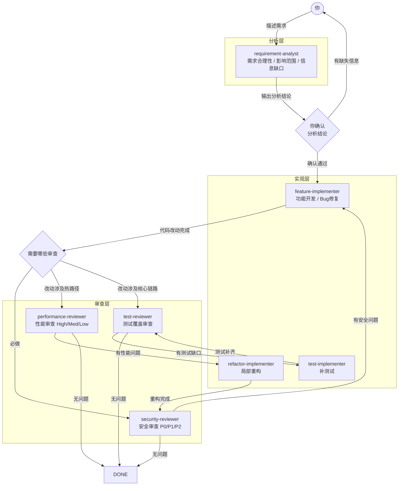
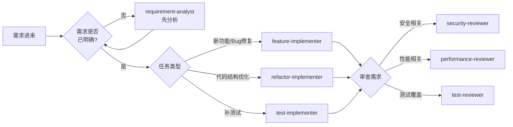
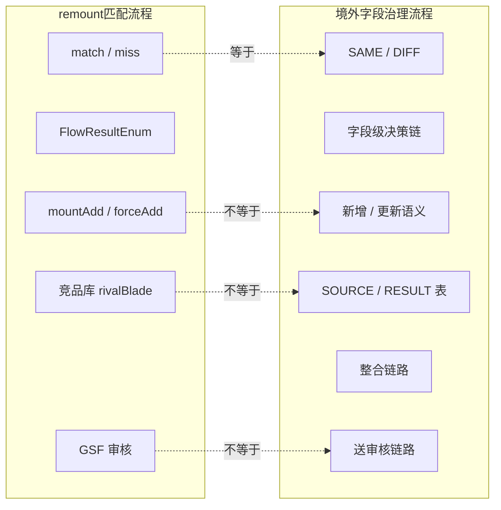

先回答几个问题：

q1：哪些场景需要上agent？一一语义模糊、if-else；一一方法论纬度

q2：实际工作中，哪些内容是可以用agent来实现的？一一监控？case排查？

# 一、弄清一个概念——what？

一个单agent往往具备的功能：


对比单agent架构，一句话总结，Multi-Agent是由多个相互作用的智能体（Agent）构成的分布式系统，通过协作、竞争或协商机制完成复杂任务，其中每个

Agent 具备独立感知、决策和执行能力，同时通过通信协实现信息共享与协同优化。

Oracle的研究员Mohita Narang画了一幅图非常合适：


这里面提到的几个多智能体系统的核心组件，和Claude Code的官方文档基本一致，核心就是：智能体、环境和互动机制。

* Agent

这些是系统内活跃的决策实体。每个智能体都具有一定程度的自主性，这意味着它可以独立工作、感知本地环境，并根据其目标和可用信息做出选择。智能体

可以是软件程序、聊天机器人、实体机器人、无人机、传感器，甚至是人类。它们是具有特定角色和功能的独立实体。

* Profile（Role）：角色是对智能体的详细描述，包括其特征、能力、行为和限制条件。在多Agent系统中，每个Agent都有自己的角色、技能和行动定

义，都是为满足特定目标而量身定制的。例如在软件开发中，Agent可能担任产品经理和工程师的角色，每个角色都拥有对应专业知识并在指导开发过

程。其实就是一个agent.md文件～

* 环境

这是LLM-MA系统运行并进行交互的具体背景或设定。环境可以是虚拟的，例如模拟世界或网络，也可以是物理的，例如机器人智能体的工厂车间。它是智能

体感知信息、执行动作以及接收反馈的基础，智能体通过观察与环境互动，理解周围情况，做出决策，并从行动的结果中学习。智能体执行动作后会从环境中

获得反馈，这可以帮助智能体改进策略。并且一部分的环境是需要共享的。

* 通信协议和语言

为了协同工作，智能体需要相互通信。通信协议是它们交换信息的规则。其中包括消息的格式（例如使用JSON 或XML）以及消息的发送方式（例如使用

HTTP 或 MQTT）。agent之间是可以进行通信，并且完成多轮A2A的对话的。

那再看一下业界目前领先的框架metaGPT，基本也是符合这种设计模式：


# 二、为什么开始推multi-Agent——why？

几个单agent解决不了的问题

1. 上下文窗口有限
   1. 单个 Agent 无法同时处理超大规模的代码库（如 20+ 个相关文件）
   2. 必须反复切换文件、丧失整体理解能力
   3. 每次切换都需要重新建立上下文，成本递增

2. 任务内的并行瓶颈，无法并行处理独立的子任务
   1. 比如：同时编写 A、B、C 三个模块时，必须串行完成，导致交付时间翻倍

3. 决策分离不足
   1. 同一 Agent 需要做规划、实现、审查、优化等多种角色，容易出现"既当裁判又当运动员"的问题，难以保证决策质量


## 2.1 一个概念的classify

为什么要做呢？在工程上面，不就是做出一个workflow吗？——no！他的核心思想是，让LLM发挥决策能力，不要通过状态机的方式来串联流程，人去为LLM做各种harness（比如做出各种tools让AI可以用，然后再用各种约束agent的构建），让agent稳定持续地发挥更大的能力。（openai harness engineering）


## 2.2 multi-agent VS subAgent

| **维度**       | **Multi-Agent**              | **SubAgent**                  |
| -------------- | ---------------------------- | ----------------------------- |
| **设计思路**   | **平级分工（工程团队模式）** | **层级授权（管理-执行模式）** |
| **Agent 关系** | **对等、协作**               | **父子、委派**                |
| **决策权**     | **各自独立 + 协商一致**      | **父决策，子执行**            |
| **通信方向**   | **双向、多向**               | **主要是上下行**              |
| **知识沉淀**   | **是，经验直接反馈到系统**   | **部分，需汇聚到主 Agent**    |

**Multi-Agent 工作流：**

```
┌─────────────┐
│ 规划 Agent  │ ← 独立分析需求、输出设计文档
└──────┬──────┘
       ↓ (共享设计)
┌──────────────────┬──────────────────┐
│ 实现 Agent A     │ 实现 Agent B      │ ← 并行工作
│ (模块 A)         │ (模块 B)          │
└────────┬─────────┴────────┬─────────┘
         ↓                  ↓
    ┌─────────────────────────────┐
    │ 审查/整合 Agent             │ ← 独立质量把关
    │ (对等的质量角度)            │
    └─────────────────────────────┘
```

**SubAgent 工作流：**

```
┌────────────────────────┐
│ 主 Agent (Orchestrator)│ ← 全局决策者
│ ├─ 分析任务            │
│ ├─ 制定计划            │
│ └─ 协调子任务          │
└────────────┬───────────┘
             ↓
    ┌────────────────────┐
    │ 子 Agent 群        │ ← 执行层
    │ ├─ SubAgent 1      │
    │ ├─ SubAgent 2      │
    │ └─ SubAgent 3      │
    └────────────────────┘
     (只能接收指令和反馈)
```


一个关键区别点**handoffs**：在 handoffs 模式中，**并不存在一个始终固定不变、居高临下的“主控智能体”**。而是每一个智能体都能够通过工具改变状态切换到别的智能体上，然后让用户与别的智能体进行对话。 

在实际的使用过程中，体现在：交接完成后，并不会再“回到”原来的主智能体进行汇总或转述。当前阶段的智能体，就是直接与用户对话的主体。在这一机制下，如果用户在对话过程中对前面的信息进行了修改，系统同样可以根据新的上下文状态**回退到前一阶段的智能体**，重新收集或修正信息，再继续后续流程。

综合来看，当**任务本身高度多变、路径不确定、需要根据情况灵活拆解和组合能力**时，Sub-agents 模式往往更加合适；

而当任务整体流程相对清晰，但**需要通过多轮对话逐步获取信息，并在不同阶段之间进行切换**时，**Multi-Agent** 模式则更具优势。

在实际系统设计中我们也完全可以进行组合使用。


# 三、如何去搭建&使用一个agent team——how？


## 1、先以一个deep research的框架介绍，为什么要进行角色划分？

**角色划分（Role Division / Specialization）是多智能体系统突破单体模型能力天花板、实现复杂任务求解的核心组织原则。** 通过角色划分，系统能够有效降低单体认知负荷、引入对抗与审查机制、实现任务解耦与并行计算，并最终在资源消耗（不同agent可以用不同的llm）与输出质量之间取得最优平衡。


## 2、尝试实现一个简单的需求？

需要多 Agent 的场景：多人使用（各有独立记忆）、多场景（日常用快速模型/深度工作用 Opus）、多渠道分离、安全隔离（限制公开群组权限）。

在日常工作中，

1. 要进行需求分析——方案评审——代码改造——测试——上线验收
2. 现在一个agent，完成需求分析后，另一个agent开始开发，开发完之后一个测试agent就去校验有没有问题。

工作流程（分层思想）：




各agent的触发条件：




语意隔离边界**（本质是划分了两套memory，目标是为了让multi-agent在写作过程中保持专注）**：



使用claude code搭建好这些内容之后 ，体验完成一个需求 ：

1. 需求分析阶段


2. 改动完成，进行汇总


3. review-agent干活，分析其中的问题


最佳实践

• 团队规模：推荐2-5个队友，3个通常比6个效果更好

• 任务拆分比人数更重要：拆分不当的6 人团队不如拆分良好的3人团队

• 读密集型任务（代码审查、研究）是 Agent Teams 的甜区

•写密集型并发编辑仍然是挑战，需要严格的文件分工

68568499

Agent Teams 的核心要点：

1. 开启方式：设置环境变量`CLAUDE_CODE_EXPERIMENTAL_AGENT_TEAMS=1`，然后用自然语言描述团队

2. 架构模式：Lead Agent 协调+Teammate Agent 并行工作，通过共享任务列表和消息系统协作
3. 最佳场景：代码审查、新模块并行开发、竞争假设调试、跨层协调、探索性研究
4. 核心原则：任务拆分比人数更重要，3个队友通常比6个效果更好
5. 成本控制：混合模型（Lead 用 Opus +队友用 Sonnet）是最佳性价比方案


个人使用感受：

1．对于直接使用catclaw的单agent形式，多agent运行得更快

2. 多agent在优化过程上面更加清晰（比如需求设计完之后，代码可以多轮改动；review-agents可以从更多的方面去指导）

3.但是多agents目前有个问题是，比较依靠好的memory（靠自己沉淀了），不然他的代码风格就和服务其他代码不太一致，这种并行会导致大量返工（比如，

可能他的整段代码都会有问题）

4. 空指针、数据截断这一块多agent思考更多，但是随之而来的就是代码写的太零散，不连贯，缺少全局视角来优化代码的流向和异常处理的统一位置，反而

降低可读性和可维护性；

> 简单说明一下这个依靠CC构造的multi-agent系统和superpower的一些区别。在架构和定位上存在区别。SuperPowers 主要是 Prompt 驱动的 Skills 框架，聚焦在编码交付环节的自动化流程。Workflow 是基于 Harness 架构（声明式DAG编排+Hook 事件驱动＋状态持久化），侧重的是自动化研发完整生命周期链路（从需求分析、技术设计到代码 PR），然后进一步地可以考虑集成一下内部平台（Ones、学城等）（通过skills的方式）；相对于superpower的通用agent角色，不感知业务；当前设计的每个 agent 内置 PO！业务技能 （poi-domain-analysis, async-flow-checklist )


# 四、写在最后？

1、一人公司是可行的，但是不再是那么的性感，结合最近claude code源码都会泄漏，现在要工程化地完成一个项目难度很大。（落地简单，维护困难）。并且很可能出现闭门造车的情况，可能一个东西做出来期望越通用，发现做这个系统的更多，并且更专业。比如做代码审查的，或许中间件团队推出一个无感接入本地memory的能力，再配合一下agent脚手架，就done了。

2、为什么现在这种工程类的事情已经不再personalize？【个人的虾，演变出一个团队的虾】这个能力感觉不久就会推出（不一定是理想态，但是它一定是方便了多人协作场景，比如讨论、群聊场景等等）。

3、相比于单个 agent系统甚至更简单的 baseline，多 agent系统在处理实际问题时似乎更容易出错（并且错得越来越离谱）。（或许可以考虑建立反馈与修正机制，减少幻觉）

4、多Agent系统不是“堆更多模型就能变强”，而是需在架构、安全、调度、治理四方面系统设计。当前阶段，更适合用于可分解、流程化、高价值的任务，并配套强验证、权限控制、可观测性等工程保障（harness～）。


# 参考：

1. https://medium.com/gaudiy-ai-lab/1b1778345ad9
2. https://adg.csdn.net/69706e17437a6b40336a3857.html
3. https://openai.com/zh-Hans-CN/index/harness-engineering/

4. 【AI工具】使用Claude Code进行开发和架构设计实践基于多智能体协作的数据分析助手https://zhuanlan.zhihu.com/p/2016495809307374819

5. claude code源码分析：https://github.com/liuup/claude-code-analysis
6. 万字详解Langchain多智能体系统之Handoffs模式：状态驱动的角色切换架构与实践指南：https://zhuanlan.zhihu.com/p/1998909307153061088
7. handoffs：https://link.zhihu.com/?target=https%3A//openai.github.io/openai-agents-python/handoffs/
