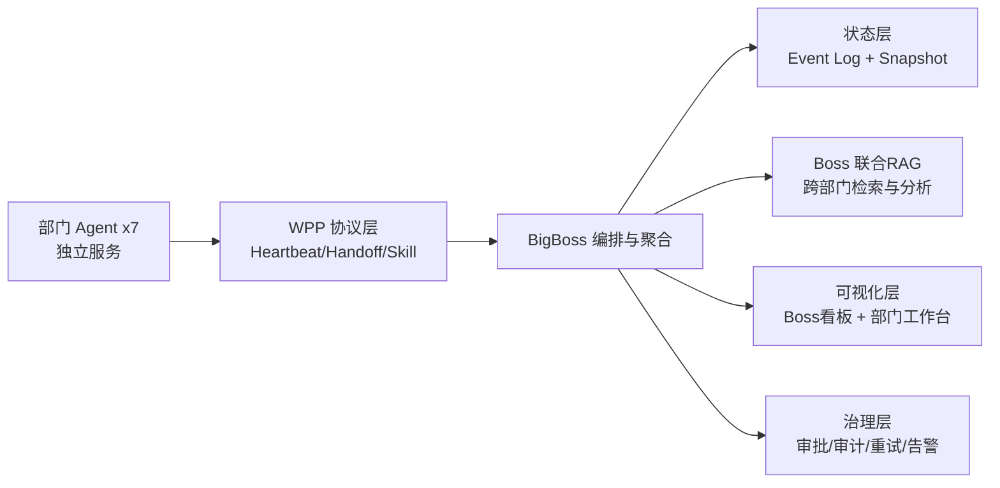
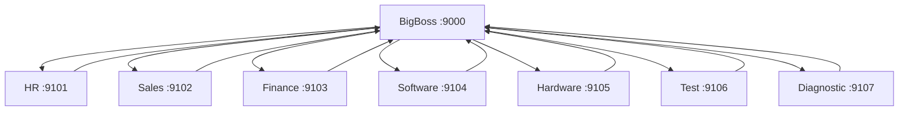
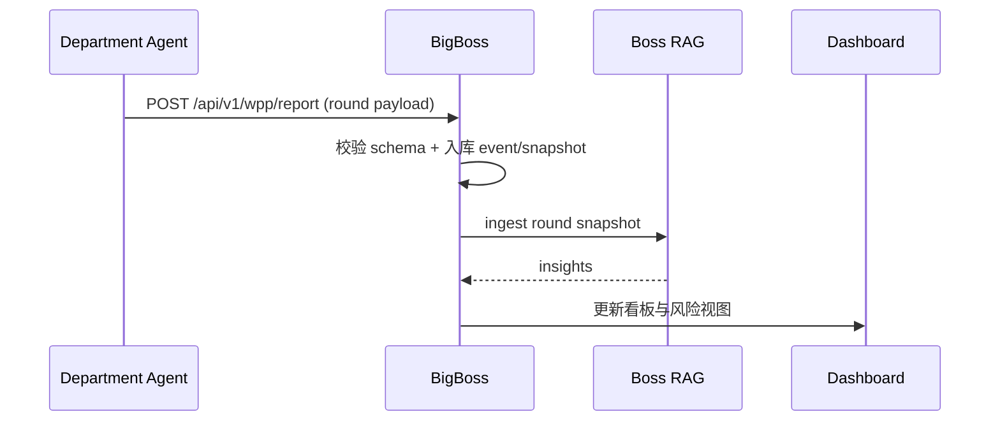
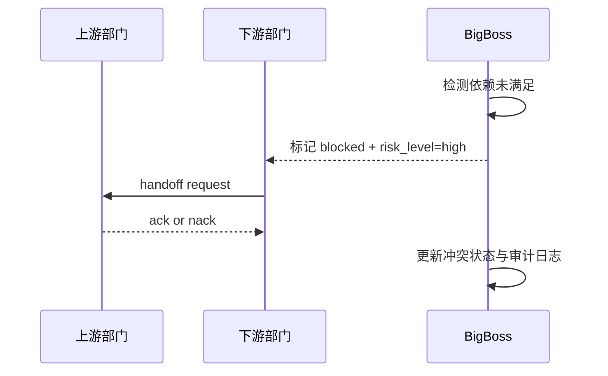

# WPP 多 Agent 协同平台项目书（实施级）

## 文档信息
- 文档版本：v1.1（实施级扩展）
- 更新日期：2026-03-03
- 适用对象：董事会/总裁办、架构委员会、产品与研发、运维与实施
- 产品名称：协同看板
- 对应系统：BigBoss + 7 部门分布式 Agent 服务

## 0. 执行摘要
WPP（Wind Pulse Protocol，风电协同脉冲协议）多 Agent 协同平台，是一套用于企业级跨部门协同治理的数字化运行系统。它解决的核心问题不是“让 AI 会聊天”，而是让多部门上报在高频节拍下具备三种能力：
- 可追溯：每一轮上报、每一条事实、每一次修订都有证据路径。
- 可联动：部门间依赖、冲突、阻塞可被系统识别并闭环。
- 可预警：通过规则评分 + LLM表达，把风险前置到管理决策前。

本项目当前已具备：
- 7 个部门独立服务（独立端口、独立工作台、独立数据目录）。
- BigBoss 聚合看板与历史复盘。
- WPP 协议化上报、部门技能共享与跨部门调用。
- 部门四层分析（事实层/记忆层/推理层/汇报层）。
- BigBoss 联合 RAG（跨部门检索与联动分析）。

## 1. 项目背景与问题定义
### 1.1 业务背景
风电企业在日常经营中存在典型的跨部门耦合：
- 诊断、测试、软硬件研发影响设备可用率。
- 财务、销售、HR 影响合同回款、资源调配与项目节奏。
- 一个部门的延迟常引发其他部门连锁延期。

### 1.2 传统协同痛点
- 上报口径不一致：同一“进度”在不同部门字段定义不同。
- 状态不可控：任务可能出现“跨级跳状态”，无法审计。
- 历史难复盘：缺乏版本化历史，对比上轮成本高。
- 管理盲区：管理层能看到结果，难看到因果链。

### 1.3 本项目要解决的问题
- 建立统一协议（WPP）与统一状态机，保障跨部门可计算协同。
- 构建“事件日志 + 快照”双轨，支持实时看板与历史复盘。
- 构建部门级与 Boss 级双层智能分析，支持跨部门联合判断。

## 2. 项目目标与边界
### 2.1 核心目标
1. 让每个部门在固定节拍内稳定上报结构化成果（deliverable）与补充项（supplement）。
2. 让 BigBoss 在单屏看到进度、风险、依赖、冲突、历史变化。
3. 让系统能回答“为什么慢了”“本轮与上轮关系是什么”“下一步先协调谁”。

### 2.2 非目标（当前阶段不覆盖）
- 完整替代 ERP/MES/CRM 等企业系统。
- 全自动无人审批闭环（预算、合同、安全仍需人工闸门）。
- 跨地域多活容灾（当前为单站点分布式部署）。

## 3. 利益相关方与治理分工
| 角色 | 关注点 | 系统责任 |
|---|---|---|
| 总裁办/BigBoss | 全局进度、风险、跨部门冲突、资源优先级 | 统一调度、审批闸门、策略下发 |
| 部门负责人 | 部门目标达成率、阻塞清除、对外依赖确认 | 维护角色契约、事实录入、定时上报 |
| 财务BP/运营 | 指标一致性、证据可追溯 | 校验数据口径、反馈纠错 |
| 架构与研发 | 系统稳定性、扩展性、部署边界 | 协议演进、模块维护、发布治理 |
| 运维 | 可用性、监控、故障恢复 | 服务守护、日志与告警 |

## 4. 总体架构设计
### 4.1 逻辑架构


### 4.2 物理部署架构（当前）


### 4.3 架构原则
- 协议优先：跨服务通信必须走 WPP 结构。
- 状态机优先：所有任务状态迁移可校验。
- 事实优先：先落结构化事实，再生成自然语言。
- 分布式优先：每部门独立演进，不依赖单体进程。

## 5. 部门 Agent 角色契约矩阵（Role Contract Registry）
| 部门 Agent | 北极星 KPI | 过程 KPI | 核心输出 Deliverable | 其他补充 Supplement | 主要上游输入 | 主要下游输出 |
|---|---|---|---|---|---|---|
| `hr-minister` | 关键岗位及时到岗率 | 招聘周期、培训覆盖率 | 关键岗位补位进展、人力风险评估 | 候选池优化、轮岗建议 | 各部门人力需求 | 各部门用工保障 |
| `sales-minister` | 回款周期与签约达成率 | 线索转化率、报价响应 SLA | 报价推进、合同节点达成 | 区域拓展机会、客户风险提示 | 财务授信、产能计划 | 财务回款计划、交付节奏输入 |
| `finance-minister` | 现金流健康度 | 报销周期、预算执行偏差 | 预算执行、回款进展、成本异常 | 成本优化提案、资金预警 | 销售合同、项目进度 | 销售授信、管理层资金风险 |
| `software-development-minister` | 软件交付准时率 | 缺陷密度、迭代吞吐 | 版本交付、缺陷修复、接口稳定性 | 性能优化建议、技术债清单 | 产品需求、测试反馈 | 测试回归包、诊断算法支持 |
| `hardware-development-minister` | 硬件可靠性 | 样机通过率、故障返修率 | 关键硬件里程碑、失效分析 | 备件优化、工艺改进项 | 诊断故障模式、测试报告 | 测试计划输入、运维替换建议 |
| `test-minister` | 质量门禁通过率 | 回归覆盖率、阻塞清零时长 | 回归结果、发布门禁结论 | 自动化测试补全建议 | 软硬件版本、需求变更 | 发布准入、缺陷风险结论 |
| `diagnostic-development-minister` | 误报率/漏报率降低 | 诊断准确率、定位耗时 | 故障诊断报告、模型更新效果 | 监控规则优化、数据采集增强 | 设备遥测、测试样本 | 软硬件改进与运维预警 |

## 6. WPP 协议设计（核心）
### 6.1 协议定位
WPP 是跨部门服务的统一交互协议，用于描述：
- 轮次（round）内各部门上报内容。
- 部门间交接（handoff）与确认（ack）。
- 跨部门技能共享调用（skill invoke）。

### 6.2 协议信封（Envelope）
```json
{
  "protocol": "WPP",
  "version": "1.0",
  "message_type": "heartbeat|report|handoff|skill_invoke|ack",
  "sender": "finance-minister",
  "round_id": "2026-03-03T10:30Z-R12",
  "payload_schema_version": "1.3",
  "sent_at": "2026-03-03T10:30:02Z",
  "payload": {}
}
```

### 6.3 30 分钟节拍（可配置）
- T-5：部门生成本轮草稿（deliverable/supplement/risk）。
- T：部门主动上报至 BigBoss（`/api/v1/wpp/report`）。
- T+5：依赖方确认交接（ack/nack）。
- T+10：未确认项触发升级（escalation）。

当前实现允许按部门动态配置同步周期（演示阶段可 1 分钟）。

### 6.4 异常策略
- 超时：立即重试 1 次，失败后指数退避最多 2 次。
- 失败：标记 `needs_human_review`，写入审计事件。
- 冲突：按优先级处理（安全 > 合规 > 可用性 > 速度 > 成本）。

## 7. 数据模型与状态机
### 7.1 核心对象
- `Task`：统一任务对象，支撑看板卡片与状态流转。
- `BlackboardEntry`：部门当前状态快照（风险、阻塞、决策、目标）。
- `CollabContract`：输入需求、输出承诺、SLA。
- `FactEvent`：事实层事件（项目里程碑/进度/资源/阻塞/证据）。
- `EventRevision`：历史事件修订记录（保留原值与新值）。
- `Feedback`：人工反馈闭环（不直接覆盖历史事实）。

### 7.2 状态机约束
- 主链路：`backlog -> ready -> in_progress -> review -> done`
- 旁路：任意状态可进入 `blocked`
- 解除：`blocked -> in_progress` 仅在 blocker 清零后允许
- 限制：禁止跨级跳转（如 `backlog -> done`）

### 7.3 双轨存储
- Event Log：不可覆盖历史，保障审计与复盘。
- Snapshot：当前真相快照，保障实时查询性能。

## 8. 四层分析能力（部门 Agent）
### 8.1 事实层（Fact Layer）
每次更新落结构化事件，关键字段包括：
- `project_id`、`milestone`
- `planned_start/end`、`actual_start/end`
- `progress_pct`、`expected_progress_pct`
- `resource_needs`、`blocker_reason`
- `owner`、`evidence_refs`
- `kpi_impact`

### 8.2 记忆层（Memory Layer）
- 短期记忆：本轮新增进展、卡点、反馈。
- 长期记忆：历史基线、长期依赖、历史决策。
- 检索过滤：时间窗口 + 项目依赖 + 指标主题。

### 8.3 推理层（Reasoning Layer）
采用“规则 + LLM”混合策略：
- 规则负责稳定判定：进度偏差、阻塞时长、资源缺口评分。
- LLM 负责表达与组织：把评分翻译成管理可读语言。

### 8.4 汇报层（Report Layer）
固定口径输出顺序：
1. 一句话总览
2. 本轮新增完成
3. 与上轮关联
4. 资源卡点
5. 超期风险预警
6. 下轮计划与需支持事项

每段挂证据引用，确保可核验。

## 9. BigBoss 联合 RAG 能力
### 9.1 与部门 RAG 的差异
- 部门 RAG：单部门局部最优，回答本部门“发生了什么”。
- Boss RAG：跨部门全局最优，回答“为什么联动影响发生”。

### 9.2 联合 RAG 实现目标
- 联合索引各部门轮次快照与关键事件。
- 提供跨部门检索与多跳分析。
- 输出跨部门影响链（部门 A 风险 -> 部门 B 阻塞 -> 业务 KPI 波动）。

### 9.3 关键接口
- `GET /api/v1/boss-rag/state`
- `POST /api/v1/boss-rag/ingest-round`
- `GET /api/v1/boss-rag/page-index/latest`
- `POST /api/v1/boss-rag/search`
- `POST /api/v1/boss-rag/analyze`
- `GET /api/v1/boss-rag/insights/latest`
- `GET /api/v1/boss-rag/insights/history`

## 10. 核心业务流程
### 10.1 常规同步流程


### 10.2 依赖冲突闭环流程


### 10.3 历史复盘流程
- 用户选择轮次 A/B。
- 系统返回该轮看板快照与差异集。
- 用户可下钻到项目级事件时间线与修订记录。

## 11. 功能模块清单（按产品视角）
### 11.1 BigBoss 看板
- 全局任务流（Backlog/Ready/In Progress/Blocked/Review/Done）。
- 部门维度泳道与风险标识。
- 历史回放与差异对比。
- 单部门指标详情与用途说明。
- 联合 RAG 洞察卡片（跨部门因果链）。

### 11.2 部门工作台
- 核心文件管理（`agent.md`、`blackboard.md`、`role_description.md`、`capability_description.md`、`skills_extends/`）。
- 上报状态管理（本轮职责输出 + 其他补充）。
- 事实录入与历史修订。
- 分析反馈闭环（反馈进入后续记忆）。
- Excel 导入转结构化事件。

### 11.3 共享技能中心
- 每部门 1-2 个可共享技能。
- 技能可配置调用权限。
- 跨部门调用带审计。

## 12. 接口总览（实施阶段常用）
### 12.1 BigBoss 接口
- 概览：`GET /api/v1/overview`
- 看板：`GET /api/v1/board`
- 历史：`GET /api/v1/history/heartbeats`、`GET /api/v1/history/board`、`GET /api/v1/history/cards`
- 同步：`POST /api/v1/sync/now`、`POST /api/v1/wpp/sync`
- 周期：`GET /api/v1/settings`、`POST /api/v1/settings/sync-interval`
- 技能：`GET /api/v1/skills/catalog`、`POST /api/v1/skills/invoke`
- 交接：`POST /api/v1/mvps/handoffs`、`POST /api/v1/mvps/handoffs/{id}/ack`

### 12.2 部门接口
- 心跳：`GET /api/v1/wpp/heartbeat`
- 主动上报：`POST /api/v1/wpp/report/now`
- 工作台：`GET /api/v1/workspace`、`POST /api/v1/workspace`
- 分析：`GET /api/v1/wpp/analysis/latest`
- 导入：`POST /api/v1/wpp/analysis/import-events`、`POST /api/v1/wpp/analysis/import-excel`
- 修订：`POST /api/v1/wpp/analysis/event-revise`
- 反馈：`POST /api/v1/wpp/analysis/feedback`

## 13. 部署与运行方案
### 13.1 启动方式
- 前台守护：`./scripts/run_distributed_foreground.sh`
- 后台模式：`./scripts/run_distributed.sh`
- 局域网模式：`./scripts/run_distributed_public.sh`

### 13.2 健康检查
```bash
curl -s ${BIGBOSS_URL:-http://bigboss:9000}/health
curl -s ${HR_MINISTER_URL:-http://hr-minister:9101}/health
curl -s ${SALES_MINISTER_URL:-http://sales-minister:9102}/health
curl -s ${FINANCE_MINISTER_URL:-http://finance-minister:9103}/health
curl -s ${SOFTWARE_MINISTER_URL:-http://software-development-minister:9104}/health
curl -s ${HARDWARE_MINISTER_URL:-http://hardware-development-minister:9105}/health
curl -s ${TEST_MINISTER_URL:-http://test-minister:9106}/health
curl -s ${DIAGNOSTIC_MINISTER_URL:-http://diagnostic-development-minister:9107}/health
```

### 13.3 外部访问
- 演示：Cloudflare quick tunnel（快速验证）。
- 生产：Cloudflare named tunnel + 固定域名 + 进程守护。

## 14. 观测与指标体系
### 14.1 过程指标
- 轮次准点率
- 阻塞时长
- 跨部门等待时长
- 依赖确认率

### 14.2 质量指标
- schema 合规率
- 上报失败率/重试率
- 人工接管率
- 反馈修正命中率

### 14.3 业务指标（风电场景）
- 停机时长下降幅度
- 误报率/漏报率变化
- 交付准时率
- 回款周期改善

## 15. 验收标准（DoD）
### 15.1 功能验收
1. 7 个部门可独立启动并周期上报。
2. BigBoss 看板可实时展示各部门任务流与风险。
3. 可按轮次查看历史并进行 A/B 差异对比。
4. 部门可导入 Excel 并转结构化事件。
5. Boss 联合 RAG 可输出跨部门分析结果。

### 15.2 非功能验收
1. 单部门服务异常不影响其他部门服务运行。
2. 同步周期修改能下发并在部门端生效。
3. 历史记录可追溯且可导出。

## 16. 风险与对策
| 风险 | 描述 | 对策 |
|---|---|---|
| 数据口径漂移 | 部门自行改字段导致不可比较 | Schema 校验 + 字段治理清单 |
| 模型输出不稳定 | LLM 结论偶发偏差 | 规则兜底 + 证据链约束 + 人工闸门 |
| 外部访问不稳定 | 临时隧道中断 | 命名隧道 + 守护重启 + 回源检查 |
| 交互复杂度上升 | 功能增多后学习成本高 | 模块分区、按钮提示、用途内嵌说明 |

## 17. 分阶段路线图
### 阶段 A（已完成）
- WPP 协议、分布式基础运行、Boss/部门看板 MVP。
- 部门四层分析、基础历史与修订能力。

### 阶段 B（进行中）
- Boss 联合 RAG 主路径接入（从工具面板升级为决策面板）。
- 冲突依赖自动建议（优先协调对象推荐）。

### 阶段 C（规划）
- 命名隧道生产化。
- 告警中心（超期、阻塞积压、SLA 违约）
- 自动周报/月报导出与归档。

## 18. 业务收益评估方法
### 18.1 管理效率收益
- 复盘准备时间（小时/周）下降。
- 跨部门协调会议时长下降。

### 18.2 经营收益
- 非计划停机损失降低（小时 * 单位停机损失）。
- 超期返工成本降低（延迟天数 * 每日机会成本）。

### 18.3 组织能力收益
- 标准化程度提升（可复用技能数、可审计事件覆盖率）。
- 能力沉淀速度提升（部门技能复用次数）。

## 19. 文件映射（实施落点）
- BigBoss 服务：`services/bigboss-service/src/server.py`
- 部门统一服务：`services/department-service/src/server.py`
- 协议公共库：`services/wpp-common/src/wpp.py`
- 协同前端资源：`services/orchestrator-service/web/`
- Boss 看板前端：`services/orchestrator-service/web/index.html`
- 部门工作台前端：`services/orchestrator-service/web/department.html`
- 系统映射文档：`docs/architecture/01_系统项目到文件映射.md`
- 本项目复盘：`docs/architecture/03_对话优化过程复盘.md`

## 20. 结论
该项目完成了从“静态汇报工具”到“分布式协同操作系统”的转变。其核心价值不在于单个模型能力，而在于：
- 通过 WPP 协议统一组织协同语言。
- 通过结构化事实和历史链路保证管理可追溯。
- 通过部门智能 + Boss 联合智能实现跨部门提前干预。

这使平台可以从演示系统稳态演进到企业级运行系统。
